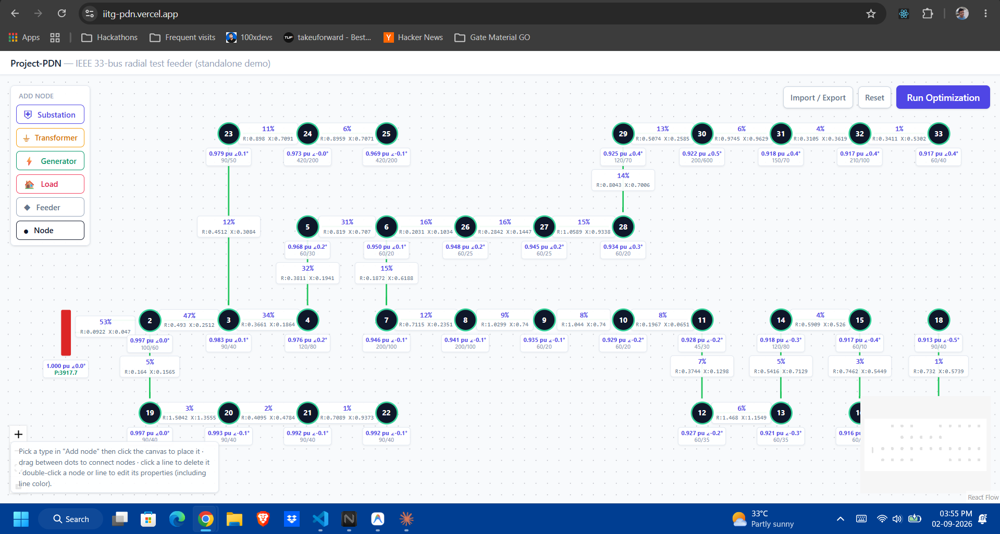

# Project-PDN

> Interactive Power Distribution Network canvas with client-side BFS load flow — built for the IITG Predoc research programme.

[](https://react.dev)
[](https://www.typescriptlang.org)
[](https://vitejs.dev)
[](https://tailwindcss.com)
[](https://reactflow.dev)

**Author:** [@merohit0](https://github.com/merohit0)

---

<!-- Add a screenshot here once ready:  -->
> 📸 _Screenshot coming soon — take one of the 33-bus canvas with colored lines and drop it here as `screenshot.png`._

---

Draw a radial distribution network on a drag-and-drop canvas, enter per-bus load (P/Q) and per-line impedance (R/X), and click **Run Optimization** to run a client-side BFS load flow. Results are overlaid directly on the canvas — buses show voltage, lines show loading percentage color-coded green → amber → red. No backend required.

---

## Prerequisites

- **Node.js ≥ 18** — run `node -v` to check
- **npm** — bundled with Node

---

## Quick start

```bash
npm install
npm run dev
```

Open the printed local URL (typically `http://localhost:5173`). The canvas loads with the **IEEE 33-bus radial distribution test feeder** — click **Run Optimization** to run the BFS load flow, color the edges by loading status, and populate the Results Panel.

```bash
# Production build
npm run build
npm run preview   # serve the dist/ folder locally to verify
```

---

## Features

| Feature | Details |
|---|---|
| Drag-and-drop canvas | Pan, zoom, add / move / delete nodes and connections |
| 6 component types | Substation, Transformer, Generator, Load, Feeder, Node |
| BFS load flow | Per-bus voltages, line currents, losses, and loading % |
| Color-coded lines | Green / amber / red by loading; manual color override |
| Results Panel | Post-solve summary chips: total losses, min voltage, max loading |
| Import / Export | Save and load topology as `.json`; clipboard paste supported |
| Auto-persistence | Every edit saved to `localStorage` — survives page reload |

---

## Component types

| Type | Rendering | Key properties |
|---|---|---|
| **Substation** | **red vertical bar** (single-line-diagram convention) | base voltage, slack-bus flag, max import |
| Transformer | full card | rated power, primary/secondary voltage, impedance, tap ratio |
| Generator | full card | max/min P & Q, generation cost |
| Load | full card | active/reactive power demand, critical flag |
| Feeder | full card | base voltage only (plain junction) |
| **Node** | **small black circle, bus number inside it** | active power (P), reactive power (Q) |

`Node` is the one to reach for in dense networks — e.g. 30+ buses and 100+ lines — where rendering every point as a full labeled card makes the canvas unreadable. It's a generic bus: hover it for a tooltip with its label/voltage/P/Q, double-click it for the full inspector, same as any other node — it just doesn't take up card-sized space on the canvas.

---

## Default demo topology

The canvas loads with the **IEEE 33-bus radial distribution test feeder** (Baran & Wu, 1989) — bus 1 is the substation (red bar), buses 2–33 are generic `Node` dots, wired with the standard 32-branch radial tree (main feeder 1→11, a zigzag 11→18, and lateral branches at 2, 3, and 6). Bus numbers are shown right under each dot, following the single-line-diagram convention.

Real per-bus load (P/Q) and per-line impedance (R/X) are not hardcoded — each bus defaults to 0 MW/MVAr and each line to a placeholder R/X. Double-click any bus or line to enter actual data through the inspector.

If you already have a saved layout (see [Persistence](#persistence)), reloading the page will keep showing it, not this default. Hit **Reset** (top-right) to switch back to the 33-bus topology.

---

## Interacting with the canvas

- **Add a node** — click a type in the "Add node" panel (top-left) to arm it (the button highlights and a banner appears), then click anywhere on the canvas to drop the node there. Click the same button again, or press `Esc`, to cancel.
- **Connect nodes** — drag from any of the 4 handles around a node (top, right, bottom, left) to any handle on another node. Connections aren't restricted to a fixed direction — drag from whichever side is closest to the other node and it routes that way.
- **Delete** — select a node or line (click) and press `Delete` / `Backspace`, or click a line and use the small ✕ button that appears at its midpoint.
- **Edit node properties** — double-click it to open the inspector sidebar (right side). Each component type shows its own fields: load MW/MVAr, generator P/Q limits and cost, transformer ratings, substation slack-bus flag. The generic **Node** shows just P and Q, kept intentionally minimal.
- **Edit line properties** — double-click a line to open its sidebar: resistance (R), reactance (X), and a **color** picker (preset swatches, custom hex input, or "A" to reset to automatic status coloring). Color is a purely visual override and never feeds into the solver.

---

## Line loading %

After running **Run Optimization**, each power line displays a small label at its midpoint showing a **loading percentage** — a standard power-systems metric:

> **Loading (%)** = (Apparent power flowing through the line ÷ Line's rated capacity) × 100

It tells you how "full" a line is relative to its thermal / rated limit.

### Visual encoding

| Loading | Edge color | Stroke width | Meaning |
|---|---|---|---|
| Not yet solved | Grey | 2 px | Unsolved / idle |
| < 85 % | Green | 2 px | Normal operation |
| 85 – 99 % | Amber | 3.5 px | Near capacity — watch this line |
| ≥ 100 % | Red | 5 px | **Overloaded** — exceeds rated limit |
| De-energized | Light grey, dashed | 2 px | Line is open / switched out |

The percentage is printed in **bold indigo** just above the R/X label at the midpoint. A manually chosen color overrides the status color, but the underlying loading value and status are unchanged.

Threshold constants (85 % warning, 100 % overload) live in `src/utils/mockSolver.ts` and `src/utils/bfsSolver.ts` — adjustable without touching any UI code.

---

## Solvers

Two client-side solvers are bundled; neither makes any network requests.

| File | Algorithm | Notes |
|---|---|---|
| `mockSolver.ts` | BFS demand aggregation | Fast approximation; propagates active-power totals from leaves to root, assigns loading % based on a fixed nominal capacity |
| `bfsSolver.ts` | BFS load flow with complex arithmetic | Full V·I\* apparent-power calculation using per-branch R + jX impedances; computes per-bus voltages, line currents, losses, and loading % |

`bfsSolver.ts` is the primary, more accurate solver and feeds the **Results Panel** summary chips.

---

## Import / Export

Click **Import / Export** (top-right) for a small modal:

- **Export** — download the current graph as a `.json` file, or copy it straight to the clipboard. Positions, parameters, colors — everything — goes with it; transient solve results are stripped since a saved file should represent the topology, not a stale snapshot.
- **Import** — pick a `.json` file, or paste JSON directly into the textarea. Either way it is validated before anything changes on screen (unknown component types, dangling edge references, duplicate IDs, and malformed JSON all produce a specific error message). On success, the canvas is replaced, re-framed into view, and autosaved to `localStorage`.

`src/utils/graphImportExport.ts` exports `serializeGraph(nodes, edges)`, which is exactly the JSON shape a `POST /api/solve` body would need when wiring to a real backend.

---

## Persistence

Every change to the canvas — nodes, connections, positions, colors, edited parameters, the last solve result — is written to `localStorage` on the fly (`src/utils/graphPersistence.ts`). Reload the page or reopen the tab and it comes back exactly as you left it. Use the **Reset** button (top-right) to clear the saved state and restore the default demo topology.

This is per-browser, client-side storage — it does not sync across devices or browsers, and clearing site data or using a private window will lose it.

---

## Known limitations

- **Radial networks only.** The BFS solver assumes a tree topology rooted at the substation. Meshed networks (rings, tie switches) are not supported and will produce incorrect results.
- **I_max not editable.** Line rated capacity defaults to a fixed value and is not exposed in the UI, so loading % is relative to this default, not real conductor ratings.
- **Single substation.** Multi-slack or multi-feeder topologies are not modelled.

---

## Architecture

```
src/
├── types/graph.types.ts        # shared node/edge/result types
├── utils/
│   ├── graphValidation.ts      # orphan/connectivity checks (client-side)
│   ├── mockSolver.ts           # fast BFS demand-aggregation approximation
│   ├── bfsSolver.ts            # full BFS load flow with complex V·I* arithmetic
│   ├── nodeDefaults.ts         # per-type labels/icons/default params
│   ├── graphPersistence.ts     # localStorage save/load/clear
│   └── graphImportExport.ts    # JSON serialize + validated parse for import/export
├── components/
│   ├── nodes/                  # Substation, Node, Transformer, Generator, Load, Feeder
│   │   └── FourSideHandles.tsx # shared top/right/bottom/left connection handles
│   ├── edges/
│   │   └── PowerLineEdge.tsx   # status-colored + user-recolorable line rendering
│   └── canvas/
│       ├── TopologyCanvas.tsx
│       ├── NodePalette.tsx         # "Add node" panel
│       ├── NodeInspectorPanel.tsx  # double-click-a-node sidebar
│       ├── EdgeInspectorPanel.tsx  # double-click-a-line sidebar (R, X, color)
│       ├── ResultsPanel.tsx        # post-solve summary chips (losses, voltages, loading)
│       └── GraphIOPanel.tsx        # Import/Export modal
├── App.tsx                     # IEEE 33-bus demo topology + page shell
└── main.tsx
```

---

## Reference

> M. E. Baran and F. F. Wu, "Network reconfiguration in distribution systems for loss reduction and load balancing," *IEEE Transactions on Power Delivery*, vol. 4, no. 2, pp. 1401–1407, Apr. 1989.

